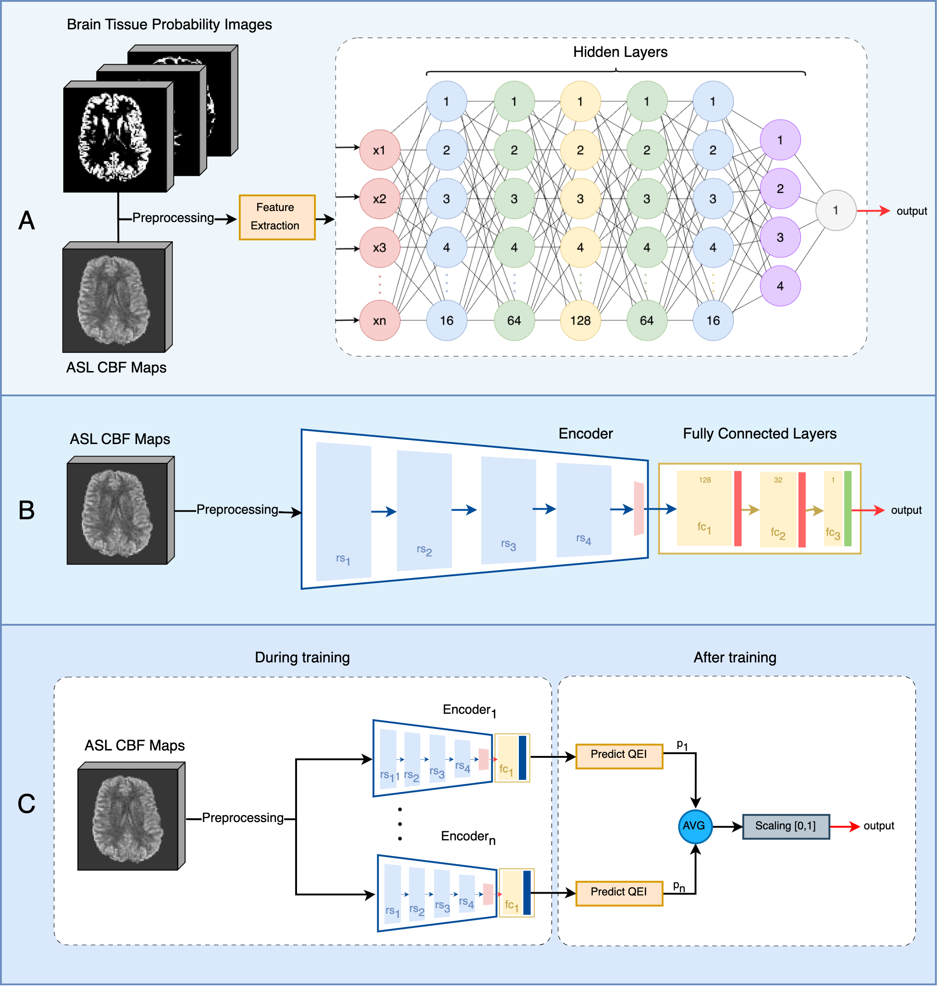

# QEI-Net: A Deep learning-based automatic quality evaluation index for ASL CBF Maps


Xavier Beltran Urbano,  Sudipto Dolui and John A Detre

## Setting Up the Project
1. Clone the project:
  ```bash
  git https://github.com/xavibeltranurbano/QEI-Net/tree/main
  cd DL-Ensemble-Brain-Tissue-Segmentation
  ```
2. Using a virtual environment is strongly recommended.
```bash
python -m venv venv
source venv/bin/activate
pip3 install -r requirements.txt
```
## Reproducing the Results
The project utilizes the following folder structure
```bash
DL-Ensemble-Brain-Tissue-Segmentation/
├── data
│   ├── ASL_1
│   ├    ├── CBF_Map.nii
│   ├    ├── CBF_Map_Reg.nii
│   ├    ├── CBF_Map_CO_Reg.nii
│   ├    ├── CBF_Map_smooth.nii
│   ├    ├── WM_prob.nii
│   ├    ├── WM_prob_Reg.nii
│   ├    ├── WM_prob_CO_Reg.nii
│   ├    ├── GM_prob.nii
│   ├    ├── GM_prob_Reg.nii
│   ├    ├── GM_prob_CO_Reg.nii
│   ├    ├── CSF_prob.nii
│   ├    ├── CSF_prob_Reg.nii
│   ├    └── CSF_prob_CO_Reg.nii
    └── ...
├── src
│   ├── src_QEINet
│   ├── src_3_FCN_QEINet
│   ├── src_8_FCN_QEINet
│   ├── src_7_FCN_QEINet
│   ├── src_MSC_QEINet
│   ├── preprocessing
│   ├── thresholding
```
To reproduce the results, choose one of the aproaches presented in this work, and execute the main.py script:
```bash
python3 src_QEINet/main.py
```
This will train and validate the model specified in "networkName" and store it in results/.

## Dataset
In this study, a dataset comprising 250 samples was utilized. The samples were collected from several large,multisite studies that utilized diverse ASL acquisition protocols, as detailed in Table 1. The ratings of the ASL CBF data were meticulously assessed by three ex- pert raters: John A. Detre, Sudipto Dolui, and Ze Wang. Each of these raters brings decades of experience in ASL CBF quality assurance, ensuring the dataset’s reli- ability and validity.

<p align="center">
  
  <br>
</p>

To ensure consistency in the evaluation process across different raters, specific guidelines were estab- lished and followed (see Figure 5). These guidelines are defined below:

* **Unacceptable (rating1):** CBF map is severely degraded by artifacts and is uninterpretable.
* **Poor (rating 2):** CBF map has one or more major artifacts, but can still potentially yield useful information.
* **Average (rating 3):** Acceptable quality CBF map with minor artifacts that do not significantly reduce. 
* **Excellent (rating 4):** High quality CBF map without artifacts.


### Metrics
The effectiveness of various approaches was analyzed using the Mean Squared Error (MSE) metric, assessing the difference between predicted and expert ratings.

### Preprocessing
Minimal preprocessing was required to maintain the integrity of the raw images:
- **FCN-QEI-Net**: Binarization of brain tissue probability maps and image smoothing.
- **CNN approaches (QEI-Net and MSC-QEI-Net)**: Affine Registration for consistent image size and normalization of image values.

### Deep Learning Models
We developed and compared several innovative models to enhance the automated quality evaluation of ASL CBF maps (see Figure 1):

- **3-Feature-based FCN (3FCN-QEI-Net)**: This model utilizes three key features traditionally used in manual quality assessments of ASL CBF maps. These features are the input of a fully connected neural network (FCN), designed to predict the Quality Evaluation Index (QEI) of the maps.

- **7-Feature-based FCN (7-FCN-QEI-Net)**: Building on the 3FCN-QEI-Net, this model incorporates four additional features to enhance the robustness and accuracy of the quality assessment. The integration of these comprehensive features allows for a more nuanced analysis of the ASL CBF maps.

- **QEI-Net**: A deep learning-based regression model specifically tailored for assessing the QEI of ASL CBF maps. QEI-Net employs advanced neural network architectures to process the raw imaging data directly, facilitating an automated, precise evaluation.

- **MSC-QEI-Net**: A novel multi-stage classification approach that leverages the assessments from individual raters. This model synthesizes the outputs into a continuous QEI by balancing the insights from multiple expert evaluations, ensuring a well-rounded and accurate measurement.

These models were rigorously tested and validated to ensure their effectiveness in real-world scenarios, aiming to reduce the manual effort required in quality assessments while increasing reliability and reproducibility.

<p align="center">
  
  <em> Figure.1. Schematic of the different deep learning pipelines implemented in this work. A) Feature-Based approach (FCN-QEI-Net) B) Regression approach (QEI-Net) C) Multi-Stage Classification approach (MSC-QEI-Net). </em>  
<br>
</p>


## References


## Conclusion
