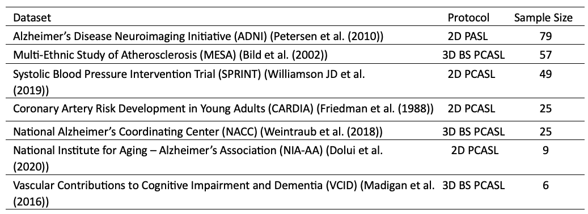
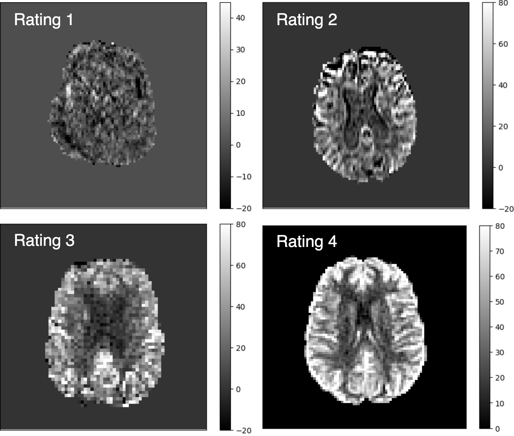
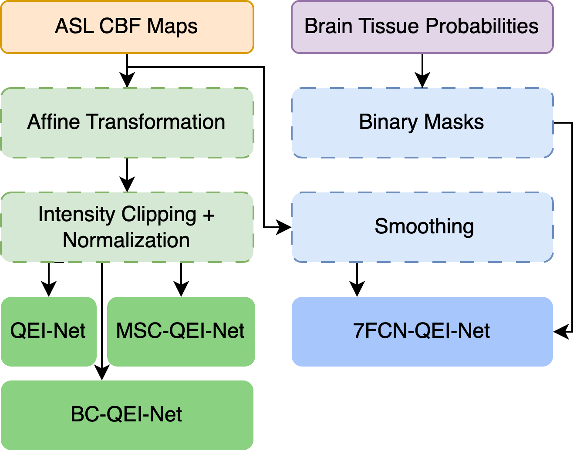
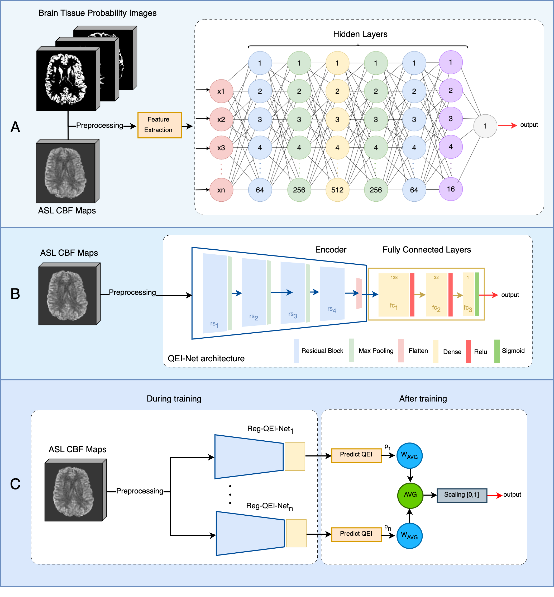

# QEI-Net: A Deep learning-based automatic quality evaluation index for ASL CBF Maps


Xavier Beltran Urbano,  Sudipto Dolui and John A Detre

## Setting Up the Project
1. Clone the project:
  ```bash
  git https://github.com/xavibeltranurbano/Reg-QEI-Net/tree/main
  cd QEI-Net
  ```
2. Using a virtual environment is strongly recommended.
```bash
python3 -m venv venv
source venv/bin/activate
pip3 install -r requirements.txt
```
## Reproducing the Results
The project utilizes the following folder structure
```bash
QEI-ASL-CBF/
├── data
│   ├── ASL_1
│   ├    ├── CBF_Map.nii
│   ├    ├── CBF_Map_Reg.nii
│   ├    ├── CBF_Map_CO_Reg.nii
│   ├    ├── CBF_Map_smooth.nii
│   ├    ├── WM_prob.nii
│   ├    ├── WM_prob_Reg.nii
│   ├    ├── WM_prob_CO_Reg.nii
│   ├    ├── GM_prob.nii
│   ├    ├── GM_prob_Reg.nii
│   ├    ├── GM_prob_CO_Reg.nii
│   ├    ├── CSF_prob.nii
│   ├    ├── CSF_prob_Reg.nii
│   ├    └── CSF_prob_CO_Reg.nii
    └── ...
├── src
│   ├── src_Reg-QEI-Net
│   ├── src_7_FCN_QEI-Net
│   ├── src_MSC_QEI-Net
│   ├── src_BC-Net
│   ├── preprocessing
```
To reproduce the results, choose one of the aproaches presented in this work, and execute the main.py script:
```bash
python3 src_Reg-QEI-Net/main.py
```
This will train and validate the selected model, storing the results in the results/ directory. Ensure to update the paths with your own directories as needed.

## Dataset
<p align="justify">
In this study, a dataset comprising 250 samples was utilized to train the different models. The samples were collected from several large, multisite studies that utilized diverse ASL acquisition protocols, as detailed in Table 1. The ratings of the ASL CBF data were meticulously assessed by three expert raters: John A. Detre, Sudipto Dolui, and Ze Wang. Dr. Detre, the inventor of ASL, has over 30 years of experience, while Dr. Dolui and Dr. Wang each have more than 10 years of experience with this technique. Their extensive experience in ASL CBF quality assurance ensures the dataset’s reliability and validity. Additionally, a separate set of 50 CBF maps rated by Dr. Detre and Dr. Dolui was used as the test set to assess the performance of the algorithms on unseen data.
</p>

<p align="center">
  
<em> Table.1. Information of the different datasets used in this work.</em>  
  <br>
</p>
<p align="justify">
To ensure consistency in the evaluation process across different raters, specific guidelines were established and followed (see Figure 5). These guidelines are defined below:
</p>
* **Unacceptable (rating1):** CBF map is severely degraded by artifacts and is uninterpretable.
* **Poor (rating 2):** CBF map has one or more major artifacts, but can still potentially yield useful information.
* **Average (rating 3):** Acceptable quality CBF map with minor artifacts that do not significantly reduce. 
* **Excellent (rating 4):** High quality CBF map without artifacts.


<p align="center">
  
</p>
<p align="center">
  <em>Figure 1. Examples of a distinct case for each rating value..</em>
</p>


### Preprocessing
<p align="justify">
Minimal preprocessing was required to maintain the integrity of the raw images:
- **FCN-QEI-Net**: Generation of binary masks corresponding to GM, WM and CSF to extract CBF signal in the regions, and image smoothing using a 5 mm isotropic kernel.
- **CNN approaches (QEI-Net,  MSC-QEI-Net and BC-Net)**: Affine Transformation for consistent image size, intensity clipping with the values [-10, 80] and normalization of intensity values.
</p>
<p align="center">
  
</p>
<p align="center">
  <em>Figure 2. Workflow of the preprocessing pipeline.</em>
</p>


### DL Models for quality assesment of ASL CBF Maps
<p align="justify">
We developed and compared several innovative models to enhance the automated quality evaluation index (QEI) of ASL CBF maps (see Figure 1):
</p>

<p align="justify">
We developed and compared several innovative models to enhance the automated quality evaluation index (QEI) of ASL CBF maps (see Figure 1):
</p>

<ul>
<li><p align="justify"><b>7-Feature-based FCN (7-FCN-QEI-Net):</b> Building on the [8]'s approach, this model incorporates four additional features to enhance the robustness and accuracy of the quality assessment. The integration of these comprehensive features allows for a more nuanced analysis of the ASL CBF maps.</p></li>

<li><p align="justify"><b>Deep learning-based regression model (Reg-QEI-Net):</b> A deep learning-based regression model specifically tailored for assessing the QEI of ASL CBF maps. QEI-Net employs advanced neural network architectures to process the raw imaging data directly, facilitating an automated, precise evaluation.</p></li>

<li><p align="justify"><b>A 3D Multi-Stage Classification Model (MSC-QEI-Net):</b> A novel multi-stage classification approach that leverages the assessments from individual raters. This model synthesizes the outputs into a continuous QEI by balancing the insights from multiple expert evaluations, ensuring a well-rounded and accurate measurement.</p></li>
</ul>

<p align="center">
  
  <em> Figure.3. Schematic of the different deep learning pipelines implemented in this work. A) Feature-Based approach (7FCN-QEI-Net) B) Regression approach (QEI-Net) C) Multi-Stage Classification approach (MSC-QEI-Net). </em>  
<br>
</p>

### A 3D Binary Classification Network (BC-Net)
<p align="justify">
One of the main objectives of this project is to develop a robust method for discarding unacceptable CBF Maps, which can be framed as a binary classification problem instead of assigning a continuous number defining the quality. Therefore, we also implemented a 3D deep learning classifier with a binary loss function to tackle the problem. For this model, we used the same parameters and architecture as the Reg-QEI-Net methodology. The only difference lies in the ground truth used to train the network. For QEI-Net, we used continuous values within the range [0,1], whereas for BC-QEI-Net, we used binary values. The output of the BC-Net, which employs a Sigmoid activation function in its final FCL, fall within the range of 0 to 1. This value represents the probability that a given sample is of acceptable quality. 
</p>

### Additional Experiments
<p align="justify">
To develop a more robust method, various combinations of the previous methods were studied. However, since some models represent the QEI and BC-Net represent the probability of possessing acceptable quality, only the best performing methodologies specifically focused on assessing a QEI (QEI-Net, 7FCN-QEI-Net, and MSC-QEI-Net) were utilized. The different combination methods are as follows:
</p>

<p align="justify">
1. <b>Ensemble 1:</b> This is the simplest ensemble method, which consists of averaging the predictions from each of the networks. 
</p>
<p align="justify">
2. <b>Ensemble 2:</b> In this method, we calculate the weighted average of the predictions. To calculate the weights of each method, we have trained a function that optimizes the weights assigned to the different models to minimize the MSE between the actual and prediction. 
</p>
<p align="justify">
3. <b>Ensemble 3:</b> This method utilizes stacking, an ensemble technique that combines the predictions of multiple base models to enhance predictive performance. In this approach, the predictions from all the QEI models serve as input features for a meta-model, which was trained using 5-fold cross validation (CV) with a Linear Regression algorithm that learns to make the final prediction by leveraging the strengths and mitigating the weaknesses of the individual models.
</p>


### Metrics
<p align="justify">
To assess the performance of the algorithms, we computed the squared errors (SE) between the average manual ratings and the automated QEI for each CBF map. In addition to that, we also reported the Pearson’s correlation coefficient between the automated QEI and the average human rating and compared that to the correlation between the raters. Finally, dividing the data as unacceptable and acceptable as described previously, we computed the receiver operating characteristic (ROC) curve, and computed the area under the curve (AUC). To establish a QEI threshold we have calculated the Youden Index (YI). The Youden Index (YI) is a statistical measure that maximizes both sensitivity and specificity. By computing the Euclidean distance between all points of the ROC curve and the ideal point located at the coordinates [1,0], the YI identifies the best operating point. Thereafter, we computed sensitivity and specificity based on the that threshold. 
</p>

### Results

### Table 1: Algorithm evaluation metrics for val set

| Method               | Median of SE (IQR)    | Pearson's Correlation Coefficient | AUC  | Sensitivity | Specificity | Youden Index |
|----------------------|-----------------------|-----------------------------------|------|-------------|-------------|--------------|
| Dolui et al. 2024 QEI| 0.00416 (0.01416)     | 0.943                             | 0.948| 0.904       | 0.922       | 0.457        |
| 7FCN-QEI-Net         | 0.01044 (0.02562)     | 0.903                             | 0.950| **0.911**   | 0.922       | 0.325        |
| Reg-QEI-Net          | 0.00611 (0.01556)     | 0.923                             | 0.958| 0.815       | **0.965**   | **0.461**    |
| MSC-QEI-Net          | 0.01348 (0.02287)     | 0.921                             | 0.941| 0.822       | 0.930       | 0.419        |
| BC-Net               |                       | 0.941                             | 0.889| 0.852       | 0.614       |              |
| Ensemble 1           | 0.00505 (0.01124)     | 0.947                             | 0.963| 0.889       | 0.930       | 0.348        |
| Ensemble 2           | **0.00432 (0.01078)** | **0.949**                         | **0.964** | 0.896       | 0.913       | 0.327        |
| Ensemble 3           | 0.00439 (0.01134)     | 0.945                             | 0.961| 0.896       | 0.904       | 0.335        |

*Table 1: Comparison of the current state-of-the-art in the field of QEI of ASL CBF Maps ((Dolui et al. (2024))’s) with the different QA methods presented in this study using the validation data set.*

### Table 2: Algorithm evaluation metrics for test set

| Method               | Median of SE (IQR)    | Pearson's Correlation Coefficient | AUC  | Sensitivity | Specificity |
|----------------------|-----------------------|-----------------------------------|------|-------------|-------------|
| Dolui et al. 2024 QEI| 0.02945 (0.05103)     | 0.808                             | 0.896| 0.865       | 0.583       |
| 7FCN-QEI-Net         | 0.01256 (0.0268)      | 0.844                             | 0.915| 0.757       | 0.571       |
| Reg-QEI-Net          | 0.01464 (0.02414)     | 0.905                             | 0.950| 0.892       | 0.765       |
| MSC-QEI-Net          | 0.02179 (0.03967)     | 0.877                             | 0.909| 0.838       | 0.625       |
| BC-Net               |                       | 0.946                             | 0.865| 0.706       |             |
| Ensemble 1           | **0.00904 (0.02551)** | 0.897                             | 0.946| 0.892       | 0.750       |
| Ensemble 2           | 0.01126 (0.02616)     | **0.905**                         | **0.946** | **0.919** | 0.786       |
| Ensemble 3           | 0.01153 (0.02659)     | **0.905**                         | **0.946** | **0.919** | **0.800**  |

*Table 2:Comparison of the current state-of-the-art in the field of QEI of ASL CBF Maps ((Dolui et al. (2024))’s) with the different QA methods presented in this study using the test data set.*


For more detailed information, please refer to the [manuscript](manuscript/MAIA_Master_Thesis_Template.pdf).

## References

[1] Petersen, E.T., Mouridsen, K., Golay, X., 2010. The quasar repro- ducibility study, part ii: Results from a multi-center arterial spin
labeling test-retest study. NeuroImage 49, 104–113.

[2] Bild, D.E., Bluemke, D.A., Burke, G.L., Detrano, R., Diez Roux, A.V., Folsom, A.R., Greenland, P., Jacob, D.R.J., Kronmal, R., Liu, K., Nelson, J.C., O’Leary, D., Saad, M.F., Shea, S., Szklo, M., Tracy, R.P., 2002. Multi-ethnic study of atherosclerosis: Ob- jectives and design. American Journal of Epidemiology 156, 871– 881. doi:10.1093/aje/kwf113.

[3] Williamson JD, Pajewski, N.M., Auchus, A.P., Bryan, R.N., Chelune, G., Cheung, A.K., Cleveland, M.L., Coker, L.H., Crowe, M.G., Cushman, W.C., Cutler, J.A., Davatzikos, C., Desiderio, L., Erus, G., Fine, L.J., Gaussoin, S.A., Harris, D., Hsieh, M.K., Johnson, K.C., Wright, C.B., 2019. Effect of intensive vs standard blood pressure control on probable dementia: A randomized clinical trial.

[4] Friedman, G.D., Cutter, G.R., Donahue, R.P., Hughes, G.H., Hul- ley, S.B., Jacobs, D.R.J., Liu, K., Savage, P.J., 1988. Cardia: Study design, recruitment, and some characteristics of the exam- ined subjects. Journal of Clinical Epidemiology 41, 1105–1116. doi:10.1016/0895- 4356(88)90080- 7.

[5] Weintraub, S., Besser, L., Dodge, H.H., Teylan, M., Ferris, S., Gold- stein, F.C., Giordani, B., Kramer, J., Loewenstein, D., Marson, D., Mungas, D., Salmon, D., Welsh-Bohmer, K., Zhou, X.H., Shirk, S.D., Atri, A., Kukull, W.A., Phelps, C., Morris, J.C., 2018. Version 3 of the alzheimer disease centers’ neuropsycho- logical test battery in the uniform data set (uds). Alzheimer Disease & Associated Disorders 32, 10–17. doi:10.1097/WAD. 0000000000000223.

[6] Dolui, S., Li, Z., Nasrallah, I.M., Detre, J.A., Wolk, D.A., 2020. Arterial spin labeling versus 18f-fdg-pet to iden- tify mild cognitive impairment. NeuroImage: Clinical 25, 102146. URL: https://www.sciencedirect.com/science/ article/pii/S2213158219304929, doi:https://doi.org/ 10.1016/j.nicl.2019.102146.

[7] Madigan, J.B., Wilcock, D.M., Hainsworth, A.H., 2016. Vascular contributions to cognitive impairment and dementia: Topical re- view of animal models. Stroke 47, 1953–1959. doi:10.1161/ STROKEAHA.116.012066.

[8] Dolui S, Wang Z, Wolf RL, Nabavizadeh A, Xie L, Tosun D, Nasrallah IM, Wolk DA, Detre JA, Alzheimer's Disease Neuroimaging I. Automated Quality Evaluation Index for Arterial Spin Labeling Derived Cerebral Blood Flow Maps. Journal of magnetic resonance imaging: JMRI. 2024. Epub 2024/02/24 21:44. doi: 10.1002/jmri.29308. PubMed PMID: 38400805.