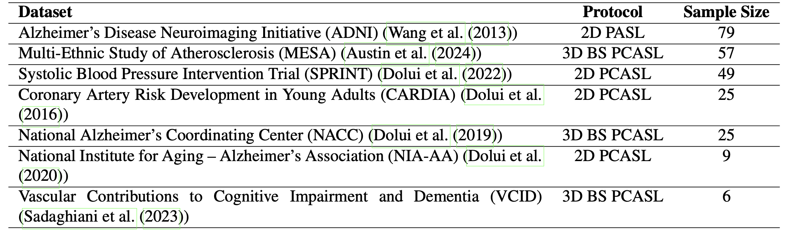

# QEI-Net: A Deep learning-based automatic quality evaluation index for ASL CBF Maps


Xavier Beltran Urbano,  Sudipto Dolui and John A Detre

## Setting Up the Project
1. Clone the project:
  ```bash
  git https://github.com/xavibeltranurbano/QEI-Net/tree/main
  cd QEI-Net
  ```
2. Using a virtual environment is strongly recommended.
```bash
python3 -m venv venv
source venv/bin/activate
pip3 install -r requirements.txt
```
## Reproducing the Results
The project utilizes the following folder structure
```bash
QEI-ASL-CBF/
├── data
│   ├── ASL_1
│   ├    ├── CBF_Map.nii
│   ├    ├── CBF_Map_Reg.nii
│   ├    ├── CBF_Map_CO_Reg.nii
│   ├    ├── CBF_Map_smooth.nii
│   ├    ├── WM_prob.nii
│   ├    ├── WM_prob_Reg.nii
│   ├    ├── WM_prob_CO_Reg.nii
│   ├    ├── GM_prob.nii
│   ├    ├── GM_prob_Reg.nii
│   ├    ├── GM_prob_CO_Reg.nii
│   ├    ├── CSF_prob.nii
│   ├    ├── CSF_prob_Reg.nii
│   ├    └── CSF_prob_CO_Reg.nii
    └── ...
├── src
│   ├── src_QEI-Net
│   ├── src_3_FCN_QEI-Net
│   ├── src_8_FCN_QEI-Net
│   ├── src_7_FCN_QEI-Net
│   ├── src_MSC_QEI-Net
│   ├── preprocessing
```
To reproduce the results, choose one of the aproaches presented in this work, and execute the main.py script:
```bash
python3 src_QEI-Net/main.py
```
This will train and validate the selected model, storing the results in the results/ directory. Ensure to update the paths with your own directories as needed.

## Dataset
In this study, a dataset comprising 250 samples was utilized. The samples were collected from several large,multisite studies that utilized diverse ASL acquisition protocols, as detailed in Table 1. The ratings of the ASL CBF data were meticulously assessed by three expert raters: John A. Detre, Sudipto Dolui and Ze Wang. Dr. Detre is the inventor of ASL and has over 30 years of experience working with this technique. Dr. Dolui and Dr. Wang each have more than 10 years of experience. Their extensive experience in ASL CBF quality assurance ensures the dataset’s reliability and validity.

<p align="center">
  
<em> Table.1. Information of the different datasets used in this work.</em>  
  <br>
</p>

To ensure consistency in the evaluation process across different raters, specific guidelines were established and followed (see Figure 5). These guidelines are defined below:

* **Unacceptable (rating1):** CBF map is severely degraded by artifacts and is uninterpretable.
* **Poor (rating 2):** CBF map has one or more major artifacts, but can still potentially yield useful information.
* **Average (rating 3):** Acceptable quality CBF map with minor artifacts that do not significantly reduce. 
* **Excellent (rating 4):** High quality CBF map without artifacts.

<p align="center">
  
  <em> Figure.1. Examples of a distinct case for each rating value.    </em>  
<br>
</p>

### Metrics
The effectiveness of various approaches was analyzed using the Mean Squared Error (MSE) metric, assessing the difference between predicted and expert ratings. Additionally, other metrics such as sensitivity, specificity, the area under the curve (AUC), and Pearson Correlation, have also been used to evaluate this study.

### Preprocessing
Minimal preprocessing was required to maintain the integrity of the raw images:
- **FCN-QEI-Net**: Binarization of brain tissue probability maps and image smoothing.
- **CNN approaches (QEI-Net,  MSC-QEI-Net and BC-Net)**: Affine Registration for consistent image size and normalization of image values.

<p align="center">
  
  <em> Figure.2. Workflow of the preprocessing pipeline.  </em>  
<br>
</p>

### DL Models for quality assesment of ASL CBF Maps
We developed and compared several innovative models to enhance the automated quality evaluation index (QEI) of ASL CBF maps (see Figure 1):

- **7-Feature-based FCN (7-FCN-QEI-Net)**: Building on the [8]'s approach, this model incorporates four additional features to enhance the robustness and accuracy of the quality assessment. The integration of these comprehensive features allows for a more nuanced analysis of the ASL CBF maps.

- **Deep learning-based regression model (QEI-Net)**: A deep learning-based regression model specifically tailored for assessing the QEI of ASL CBF maps. QEI-Net employs advanced neural network architectures to process the raw imaging data directly, facilitating an automated, precise evaluation.

- **A 3D Multi-Stage Classification Model (MSC-QEI-Net)**: A novel multi-stage classification approach that leverages the assessments from individual raters. This model synthesizes the outputs into a continuous QEI by balancing the insights from multiple expert evaluations, ensuring a well-rounded and accurate measurement.

<p align="center">
  
  <em> Figure.3. Schematic of the different deep learning pipelines implemented in this work. A) Feature-Based approach (7FCN-QEI-Net) B) Regression approach (QEI-Net) C) Multi-Stage Classification approach (MSC-QEI-Net). </em>  
<br>
</p>

### Discarding Unacceptable Images
One of the objectives of this project is to develop a methodology for rejecting CBF maps with unacceptable quality to avoid bias in subsequent statistical analysis. After computing the QEI using the presented DL approaches, we calculated the Youden Index (YI) to set the threshold between data to retain and data to exclude. Expert ratings were binarized as follows: images rated 1 by any rater were classified as Unacceptable Quality (0), while all other images were classified as Acceptable Quality (1). Using the YI, we set the threshold to discard unacceptable quality ASL CBF maps. Additionally, we calculated a customized threshold which ensures a sensitivity of at least 95%.

### A 3D Binary Classification Network (BC-Net)
One of the main objectives of this project is to develop a robust method for discarding unacceptable CBF Maps, which can be framed as a binary classification problem instead of assigning a continuous number defining the quality. Therefore, we also implemented a 3D deep learning classifier with a binary loss function to tackle the problem. For this model, we used the same parameters and architecture as the QEI-Net methodology described in Section 3.6. The only difference lies in the ground truth used to train the network. For QEI-Net, we used continuous values within the range [0,1], whereas for BC-QEI-Net, we used binary values. The output of the BC-Net, which employs a Sigmoid activation function in its final FCL, fall within the range of 0 to 1. This value represents the probability that a given sample is of acceptable quality. 

### Additional Experiments
To develop a more robust method, various combinations of the previous methods were studied. However, since some models represent the QEI and BC-Net represent the probability of possessing acceptable quality, only the best performing methodologies specifically focused on assessing a QEI (QEI-Net, 7FCN-QEI-Net, and MSC-QEI-Net) were utilized. The different combination methods are as follows:
1.	**Ensemble 1:** This is the simplest ensemble method, which consists of averaging the predictions from each of the networks. 
2.	**Ensemble 2:** In this method, we calculate the weighted average of the predictions. To calculate the weights of each method, we have trained a function that optimizes the weights assigned to the different models to minimize the MSE between the actual and prediction. 
3.	**Ensemble 3:** This method utilizes stacking, an ensemble technique that combines the predictions of multiple base models to enhance predictive performance. In this approach, the predictions from all the QEI models serve as input features for a meta-model, which was trained using leave-one-out cross-validation (LOO CV) with a Linear Regression algorithm that learns to make the final prediction by leveraging the strengths and mitigating the weaknesses of the individual models.

### Results

### Table 1: Quality Assessment performance

| Approach                        | SE (Mean) | SE (std) | Pearson Correlation |
|---------------------------------|-----------|----------|---------------------|
| (Dolui et al. (2024))’s approach| 0.02160   | 0.03184  | 0.90338             |
| 7FCN-QEI-Net                    | 0.01646   | 0.02986  | 0.92312             |
| QEI-Net                         | 0.01251   | 0.02213  | 0.94262             |
| MSC-QEI-Net                     | 0.02491   | 0.02659  | 0.91202             |
| Ensemble 1                      | 0.01144   | 0.02008  | 0.94725             |
| Ensemble 2                      | **0.01112**   | **0.01917**  | **0.94864**             |
| Ensemble 3                      | 0.01144   | 0.02011  | 0.94710             |

*Table 1: Comparison of SE (Mean and std) and Pearson Correlation across different approaches.*

### Table 2: Performance on discarding unacceptable CBF Maps by utilizing the Youden Index (YI) and a customized threshold for 95% sensitivity 

| Approach               | AUC    | Sensitivity (YI) | Specificity (YI) | YI Value | Sensitivity (95%) | Specificity (95%) | Threshold Value (95%) |
|------------------------|--------|------------------|----------------|----------|-------------------|-------------------|-----------------------|
| Dolui et al. 2024 QEI  | 0.94754| 0.9037           | 0.92174        | 0.45681  | **0.96296**           | 0.54783           | 0.21641               |
| 7FCN-QEI-Net           | 0.95027| **0.91111**          | 0.92174        | 0.32457  | 0.95556           | 0.66957           | 0.16466               |
| QEI-Net                | 0.95768| 0.81481          | **0.96522**        | 0.46078  | 0.95556           | 0.7913            | 0.24179               |
| MSC-QEI-Net            | 0.93739| 0.79259          | 0.95652        | 0.41027  | 0.95556           | 0.57391           | 0.2615                |
| BC-QEI-Net             | 0.94074| 0.88889          | 0.85217        | 0.61382  | 0.95556           | 0.66087           | 0.21526               |
| Ensemble 1             | 0.96329| 0.88889          | 0.93043        | 0.34831  | 0.95556           | **0.8087**            | 0.23381               |
| Ensemble 2             | **0.96367**| 0.8963           | 0.91304        | 0.32739  | 0.95556           | 0.8               | 0.23538               |
| Ensemble 3             | 0.96245| 0.8963           | 0.91304        | 0.32634  | 0.95556           | 0.7913            | 0.23197               |

*Table 2: Comparison of AUC, Sensitivity, Specificity, YI Value, and Threshold Value at 95% Sensitivity across different approaches.*


For more detailed information, please refer to the [manuscript](manuscript/MAIA_Master_Thesis_Template.pdf).

## References

[1] Petersen, E.T., Mouridsen, K., Golay, X., 2010. The quasar repro- ducibility study, part ii: Results from a multi-center arterial spin
labeling test-retest study. NeuroImage 49, 104–113.

[2] Bild, D.E., Bluemke, D.A., Burke, G.L., Detrano, R., Diez Roux, A.V., Folsom, A.R., Greenland, P., Jacob, D.R.J., Kronmal, R., Liu, K., Nelson, J.C., O’Leary, D., Saad, M.F., Shea, S., Szklo, M., Tracy, R.P., 2002. Multi-ethnic study of atherosclerosis: Ob- jectives and design. American Journal of Epidemiology 156, 871– 881. doi:10.1093/aje/kwf113.

[3] Williamson JD, Pajewski, N.M., Auchus, A.P., Bryan, R.N., Chelune, G., Cheung, A.K., Cleveland, M.L., Coker, L.H., Crowe, M.G., Cushman, W.C., Cutler, J.A., Davatzikos, C., Desiderio, L., Erus, G., Fine, L.J., Gaussoin, S.A., Harris, D., Hsieh, M.K., Johnson, K.C., Wright, C.B., 2019. Effect of intensive vs standard blood pressure control on probable dementia: A randomized clinical trial.

[4] Friedman, G.D., Cutter, G.R., Donahue, R.P., Hughes, G.H., Hul- ley, S.B., Jacobs, D.R.J., Liu, K., Savage, P.J., 1988. Cardia: Study design, recruitment, and some characteristics of the exam- ined subjects. Journal of Clinical Epidemiology 41, 1105–1116. doi:10.1016/0895- 4356(88)90080- 7.

[5] Weintraub, S., Besser, L., Dodge, H.H., Teylan, M., Ferris, S., Gold- stein, F.C., Giordani, B., Kramer, J., Loewenstein, D., Marson, D., Mungas, D., Salmon, D., Welsh-Bohmer, K., Zhou, X.H., Shirk, S.D., Atri, A., Kukull, W.A., Phelps, C., Morris, J.C., 2018. Version 3 of the alzheimer disease centers’ neuropsycho- logical test battery in the uniform data set (uds). Alzheimer Disease & Associated Disorders 32, 10–17. doi:10.1097/WAD. 0000000000000223.

[6] Dolui, S., Li, Z., Nasrallah, I.M., Detre, J.A., Wolk, D.A., 2020. Arterial spin labeling versus 18f-fdg-pet to iden- tify mild cognitive impairment. NeuroImage: Clinical 25, 102146. URL: https://www.sciencedirect.com/science/ article/pii/S2213158219304929, doi:https://doi.org/ 10.1016/j.nicl.2019.102146.

[7] Madigan, J.B., Wilcock, D.M., Hainsworth, A.H., 2016. Vascular contributions to cognitive impairment and dementia: Topical re- view of animal models. Stroke 47, 1953–1959. doi:10.1161/ STROKEAHA.116.012066.

[8] Dolui S, Wang Z, Wolf RL, Nabavizadeh A, Xie L, Tosun D, Nasrallah IM, Wolk DA, Detre JA, Alzheimer's Disease Neuroimaging I. Automated Quality Evaluation Index for Arterial Spin Labeling Derived Cerebral Blood Flow Maps. Journal of magnetic resonance imaging: JMRI. 2024. Epub 2024/02/24 21:44. doi: 10.1002/jmri.29308. PubMed PMID: 38400805.